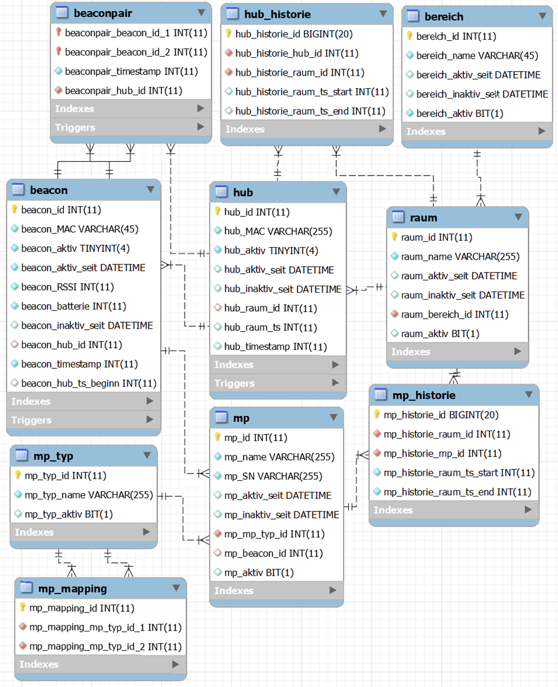

# ATS - SQL-DB (MariaDB)

This repository contains the database structure that was used for the Asset Tracking System as part of the bachelor thesis.

The code for creating the database can be found in "DB-SQL-Script.sql".
The other two SQL files are intended for the initial filling of the database so that it can be tested after creation.

Below is a picture of the EER when viewd in the MySQL Workbench.
